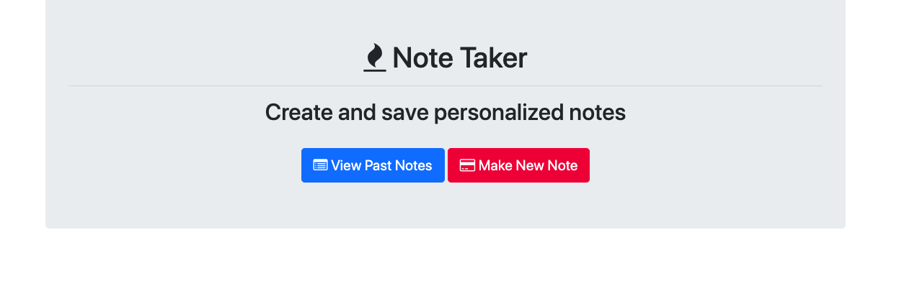

# note-taker
The note taker application is a general application to store and create a basic list of your notes. 
When opening the note taker application, you will be directed to the main page that will let you choose either to create a new note or view the list of notes that have been previously made. Each note will include the following subject of the note, date, and the actual note itself. 
Technologies used to create the note taker application are: 
*HTML,CSS,Javascript

